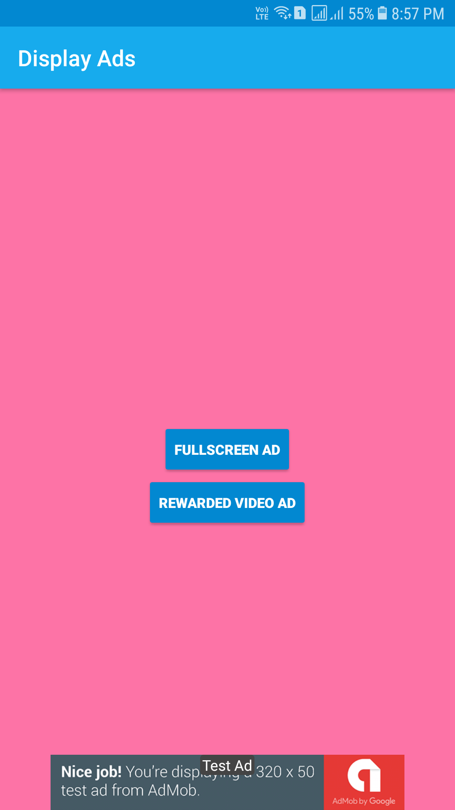

<h1 align="center">Displaying Ads</h1>

In this app i will show you how to put Banner Ads, Interstitial Ads and Rewarded video Ads

  

## Sample App
You can download the latest sample APK from Google Play:

    
<table align="center">
    <tr>
        <th>
            
        </th>
        <th>
            
        </th>
        <th>
            
        </th>
    </tr>
    <tr>
    	<td>Banner Ad</td>
    	<td>Interstitial Ad</td>
      <td>Rewarded video Ad</td>
    </tr>
</table>
